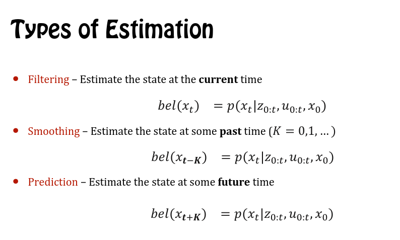

# Kalman Filter
- Kalman filter is bayes filter for the gaussian linear case
## Bayes filter
In probability theory, statistics, and machine learning, recursive Bayesian estimation, also known as a Bayes filter, is a general probabilistic approach for estimating an unknown probability density function (PDF) recursively over time using incoming measurements and a mathematical process model. The process relies heavily upon mathematical concepts and models that are theorized within a study of prior and posterior probabilities known as Bayesian statistics. 

- Performs recursice state estimation
- Prediction step to exploit controls 
- Correction step to exploit the obserbations

## References 
1. <https://www.youtube.com/watch?v=E-6paM_Iwfc>